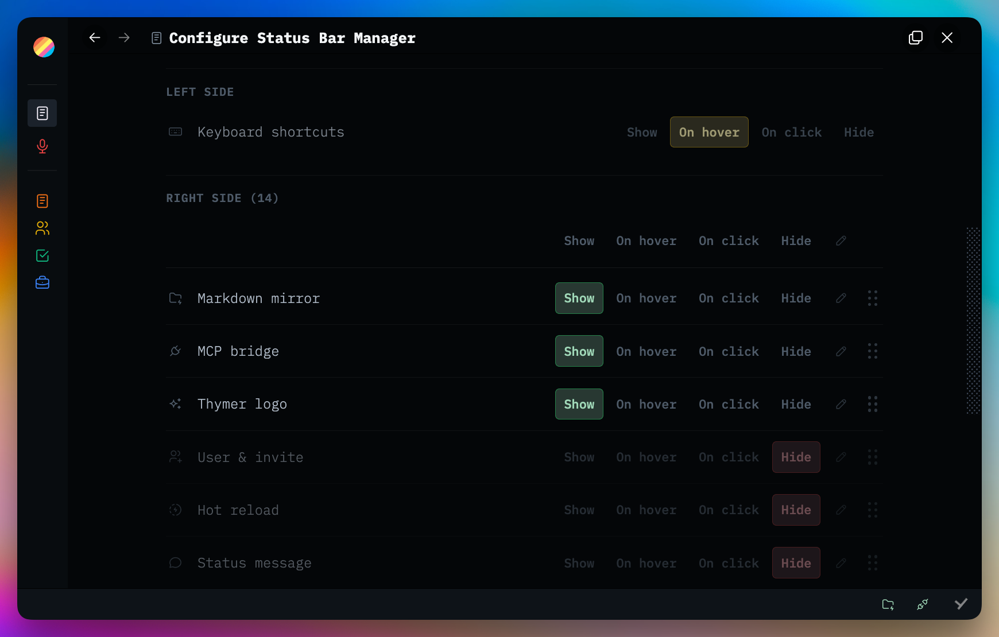

# Status Bar Manager

Global Thymer plugin for controlling the bottom status bar.

Plugins are made with 🤍 for the Thymer community. Free to use, fork, and hack on for <a href="LICENSE" target="_blank" rel="noopener noreferrer">non-commercial use</a>.

Plug-ins take effort, hours, and credits to build. If you find them helpful for you and your workflows, a star ⭐ on the repo, a <a href="https://buymeacoffee.com/akaready" target="_blank" rel="noopener noreferrer">coffee</a> ☕, and a link back to <a href="https://akaready.com" target="_blank" rel="noopener noreferrer">@akaready</a> 🔗 all go a long way. Optional of course, but always appreciated.

Enjoy! 🙏

  

&nbsp;

## 📦 Install

**Recommended:** Use the <a href="https://github.com/ahpatel/thymer-plugins-manager" target="_blank" rel="noopener noreferrer">Thymer Plugins Manager</a> and install via <a href="https://github.com/akaready/thymer-[^"]*" target="_blank" rel="noopener noreferrer">this repo's URL</a> for auto updates.

**Manual:** copy <a href="plugin.js" target="_blank" rel="noopener noreferrer"><code>plugin.js</code></a> and <a href="plugin.json" target="_blank" rel="noopener noreferrer"><code>plugin.json</code></a> from this repo into Thymer's plugin editor.

&nbsp;

## ✨ What It Does

- Adds a settings panel: **Plugin: Status Bar Manager**.
- Lets every status bar item use one of four modes:
  - **Show**: normal visibility.
  - **Hide**: fully hidden.
  - **Hover**: revealed while hovering the bar.
  - **Drawer**: revealed when the status bar surface is clicked.
- Supports keyboard shortcut hints, plugin icons, Thymer logo, sync indicator,
  user/avatar area, and the plugin's own trigger.
- Supports icon-only labels, spacing/alignment controls, ordering, unified hover
  styling, split left/right hover zones, and reveal animation staggering.
- Single-clicking the Status Bar Manager trigger opens settings. The trigger no
  longer needs a double-click because Drawer reveal lives on the bar surface.

&nbsp;

## ⚙️ How It Works

This is an `AppPlugin` rendered with `shared/settings-ui`. On load it:

- injects shared panel CSS plus status-bar-specific CSS;
- creates a persistent status bar trigger;
- registers a command palette settings entry;
- registers a custom settings panel;
- classifies current status bar children into left/right groups;
- applies body classes, item attributes, CSS variables, and ordering metadata;
- attaches status bar hover listeners for the Hover and Drawer reveal behavior.

The Hover mode reuses the same reveal/close animation model as Drawer mode.
When split hover zones are enabled, the left half reveals keyboard shortcuts and
the right half reveals plugin/right-side icons.

Synced state lives in `plugin.json` under `custom.state`. Local storage is kept
as a workspace-scoped fast override/cache:

- `plg-status-bar-manager/<workspaceGuid>/state`

&nbsp;

## 📝 Important Implementation Notes

- The plugin pins to Thymer's current status bar DOM:
  - `.statusbar--status-bar`
  - `.statusbar--left`
  - `.statusbar--right`
- The plugin trigger can be hidden or shown, but settings remain reachable from
  the command palette.
- `saveConfiguration()` is debounced and equality-checked so settings sync
  across clients without per-hover/per-toggle reload storms.
- Hover background is painted by one overlay layer to avoid nested hover chips
  and flicker.
- Event listeners, timers, observer references, overlay nodes, and body classes
  are cleaned up in `onUnload()`.

&nbsp;

## 📊 Anonymous Usage Counter

This plugin pings a <a href="https://www.goatcounter.com/" target="_blank" rel="noopener noreferrer">privacy-respecting counter</a> on first install and once per day of active use. It exists so I can see which plugins are worth continuing to invest in — both "did anyone install it" and "is anyone still using it after a week." Combined with the coffee donations, this is what tells me whether to keep building. It tracks the plugin slug only, no other telemetry or user data, and you can see exactly what I see on the <a href="https://thymer-plugins.goatcounter.com" target="_blank" rel="noopener noreferrer">public dashboard</a>.

**Opt out:** Do Not Track, or `localStorage.setItem('tps-telemetry-opt-out','1')` in the console.
